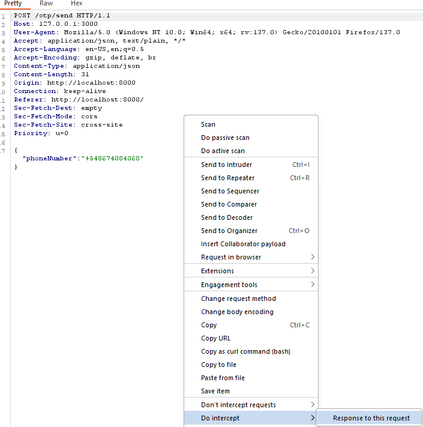
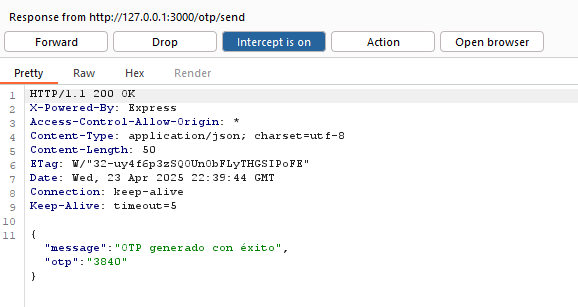

# OTP Leak in the Response

🛡️ **OWASP Category:** A07:2021 - Identification and Authentication Failures  
🧩 **CWE Category:** CWE-200: Exposure of Sensitive Information to an Unauthorized Actor  

---

## 📝 Description

Some applications send One-Time Passwords (OTPs) as part of the HTTP response after a user requests authentication via phone or email. This behavior leaks sensitive information directly to the client and undermines the entire OTP mechanism.

Typical flow:
- A user enters their phone or email to request an OTP.
- The server generates the OTP and **includes it in the response**, along with a success message.
- The same OTP is also sent to the user via SMS or email.

This leak may not be obvious in the frontend UI, but is clearly visible when inspecting network traffic or using tools like Burp Suite.

## 🐐 PayGOAT Example

To replicate this vulnerability in the lab environment, follow these steps:

1. 📱 **Navigate to the “Forgot Password” flow**  
   - Go to the application's login page.
   - Click on “Forgot Password”.
   - You’ll be prompted to enter your phone number to receive an OTP.


2. ⚙️ **Capture the OTP request**  
   - Enter a valid phone number (use your own test account).
   - Intercept the request where the OTP is generated and sent.
   - Rigth-click and use the option: Do intercept -> Response to this request



3.  🔍 **Inspect the response** 
   - In the HTTP response, look for fields like:
     ```json
     {
       "message": "OTP generado con éxito",
       "otp": "1906",
     }
     ```


---

## 💥 Impact

- **Authentication bypass:** If an attacker can trigger OTP generation and read the response, they can log in as the user without needing access to the victim's phone or email.
- **Account takeover:** With no second factor protecting the OTP, an attacker can hijack accounts easily.
- **Control flow bypass:** Allows use of OTP-protected functionality without access to the phone number.

---