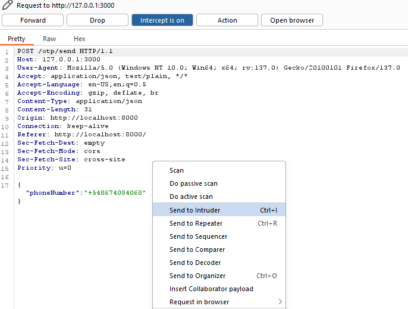
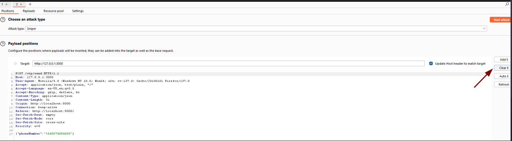
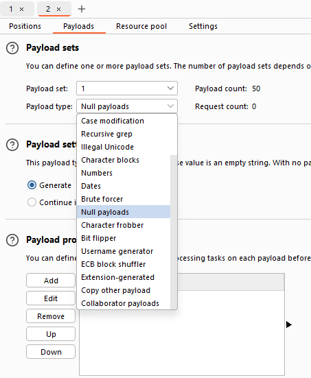
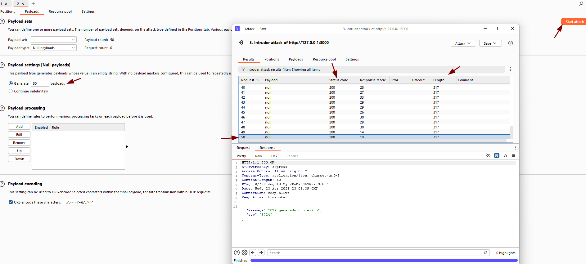

# Rate-Limiting OTP Generation

🛡️ **OWASP Category:** A07:2021 - Identification and Authentication Failures  
🧩 **CWE Category:** CWE-307: Improper Restriction of Excessive Authentication Attempts  

---

## 📝 Description

This vulnerability occurs when an application allows users to generate One-Time Passwords (OTPs) repeatedly without enforcing a rate limit or cooldown period.

Attackers can abuse this behavior to:

- Flood a victim with OTP messages (SMS, email, or app notifications).
- Perform brute-force attempts to guess the OTP.
- Enumerate valid user accounts based on system responses.
- Exhaust backend resources (SMS gateway, email services).

## 🐐 PayGOAT Example

To replicate this vulnerability in the lab environment, follow these steps:

1. 📱 **Navigate to the “Forgot Password” flow**  
   - Go to the application's login page.
   - Click on “Forgot Password”.
   - You’ll be prompted to enter your phone number to receive an OTP.
   - Enter a valid phone number (use your own test account or victim ;).
   - Intercept the request where the OTP is generated and sent.
   - Rigth-click and use the option: Send to Intruder
   

2. 🎯 **Set the attack position**
   - Go to the Intruder tab.
   - Go to the **Positions** tab.
   - Click on `Clear §` to remove any auto-marked parameters.

3. ⚙️ **Configure the payload type**
   - Go to the **Payloads** tab.
   - **Payload type**: select `Null payloads`.
   - **Number of payloads**: set how many times you want the request to be sent (e.g., 50 or 100).

4.  🚀 **Start the attack**
    - Click `Start attack`.
    - Burp will send the exact same request repeatedly.
    - Observe that the status codes and lengths remain the same when the OTPs are generated correctly. In this example, we configured 50 requests, all of which were executed without any kind of blocking.

---

## 💥 Impact

- **Denial of Service (DoS):** Victims can be overwhelmed with OTP messages, making it difficult or impossible to use the service.
- **Resource Abuse:** Unrestricted requests may incur high costs through third-party messaging services.

---