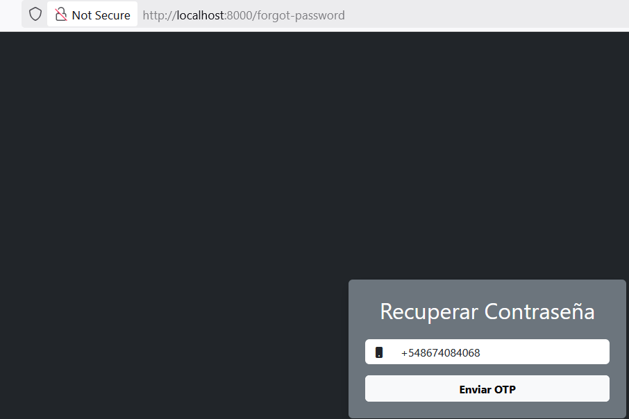
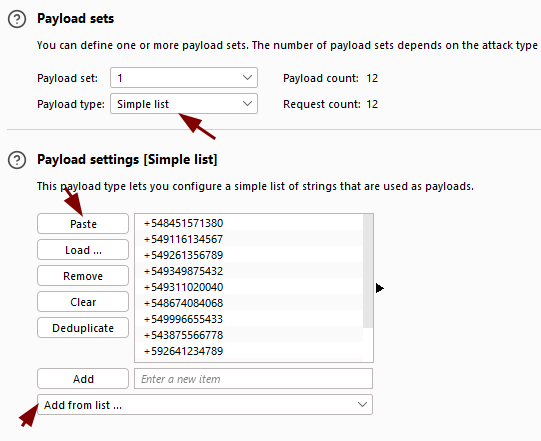

# User Enumeration via Phone Number

🛡️ **OWASP Category:** A01:2021 - Broken Access Control  
🧩 **CWE Category:** CWE-203 - Observable Discrepancy

---

## 📝 Description

The password recovery mechanism fails to properly validate the user identity. It only asks for the phone number to initiate the OTP process, without requiring additional information such as username or email.

This allows an attacker to perform **user enumeration** by automating OTP requests using leaked or commonly used phone numbers. Depending on the application's response (e.g., "OTP generated" vs "User not found"), the attacker can determine which phone numbers are registered.

---

## 🐐 PayGOAT Example

To replicate this vulnerability in the lab environment, follow these steps:

1. Navigate to the **Forgot Password** feature in the application.
2. Enter any valid or dummy phone number and intercept the request using **Burp Suite**.

3. Send the intercepted request to **Intruder**.

4. Identify the phone number field as the attack position (use § markers).

5. In the **Payloads** tab:
   - Set **Payload type** to `Simple list`.
   - Load a list of leaked or common phone numbers.
   - Unmark Payload encoding, If the application does not interpret URL encoding it will return some kind of error. 

6. Start the attack.
7. Observe the responses:
   - Different status codes, messages, or response lengths may reveal which numbers are valid.

---

## 💥 Impact

Account discovery becomes trivial, enabling **targeted attacks**, social engineering, and brute-force attacks against known users.

---
