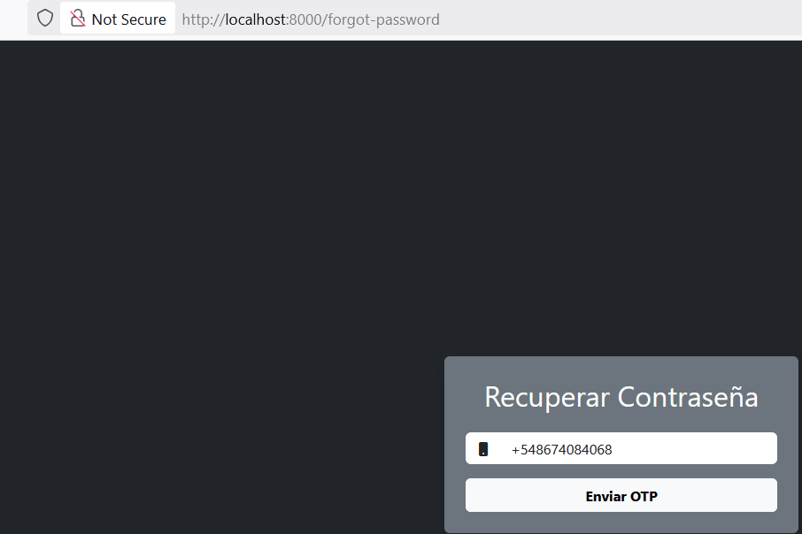
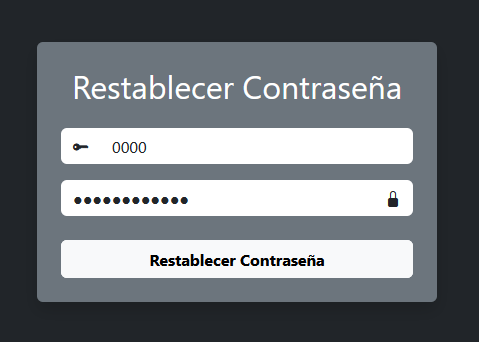
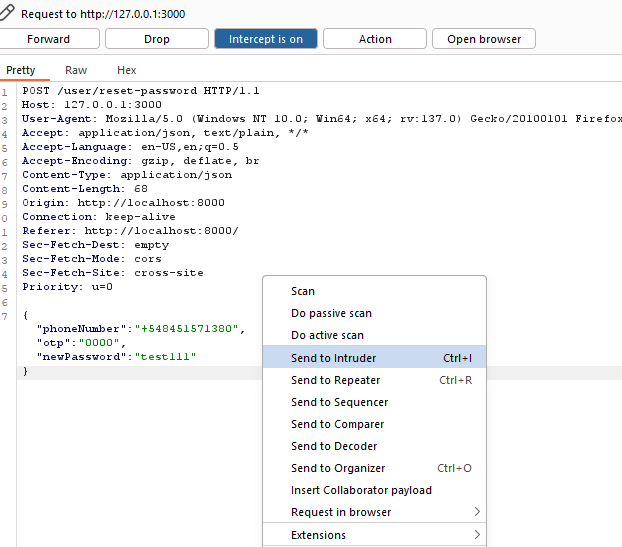
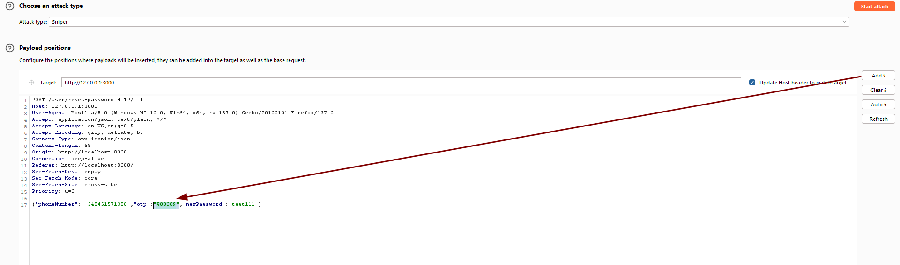
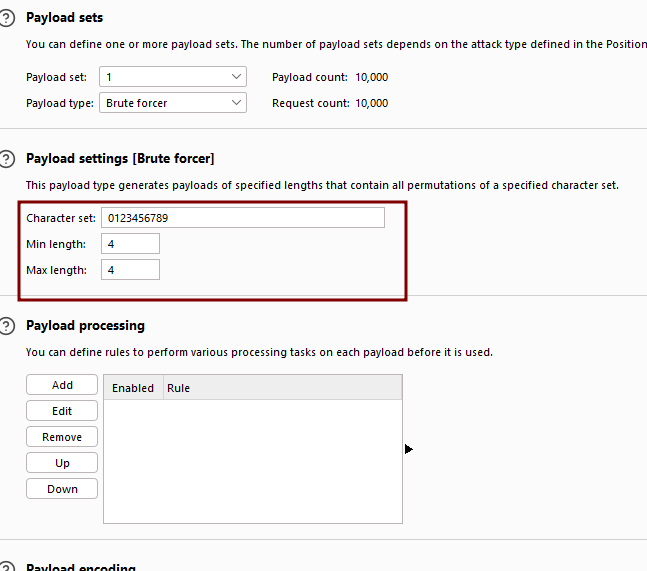
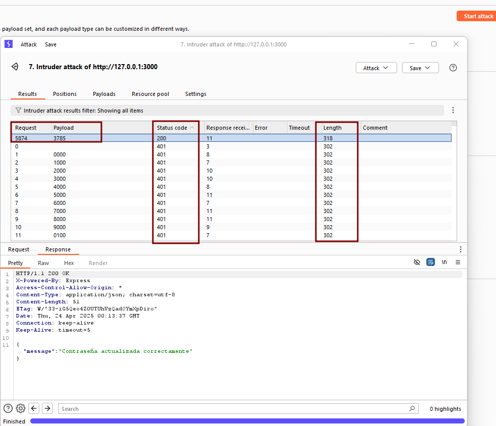

# OTP Brute-Force Attack

🛡️ **OWASP Category:** A07:2021 - Identification and Authentication Failures 
🧩 **CWE Category:** CWE-307: Improper Restriction of Excessive Authentication Attempts

---

## 📝 Description

The OTP verification mechanism is vulnerable to a brute-force attack. The application does not enforce a limit on the number of OTP validation attempts, allowing an attacker to try multiple guesses without any throttling, account lockout, or rate-limiting.

Additionally, the OTP is only **4 digits long**, significantly reducing the entropy and making it easier to guess through automated attacks. Combined, these flaws enable attackers to potentially bypass OTP-based authentication mechanisms.

---

## 🐐 PayGOAT Example

To replicate this vulnerability in the lab environment, follow these steps:

1. Trigger the **Forgot Password** or any feature that sends an OTP to a known phone number.

2. Intercept the OTP validation request using **Burp Suite**.
3. Send the request to **Intruder**.

4. Mark the OTP parameter with `§`.

5. Use **Brute Force** payload:
   - Remove letter
   - Min length 4
   - Max length 4

6. Start the attack.
7. Look for a change in response indicating a successful OTP guess (e.g., status code, message, length).

---

## 💥 Impact

Control flow bypass — allows unauthorized access to protected functions by guessing the OTP, in this case change password to any user.

---
