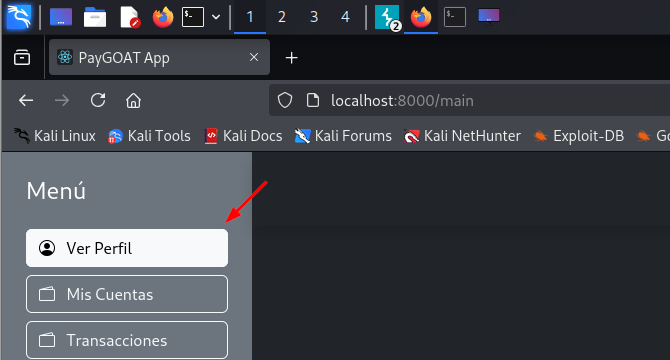
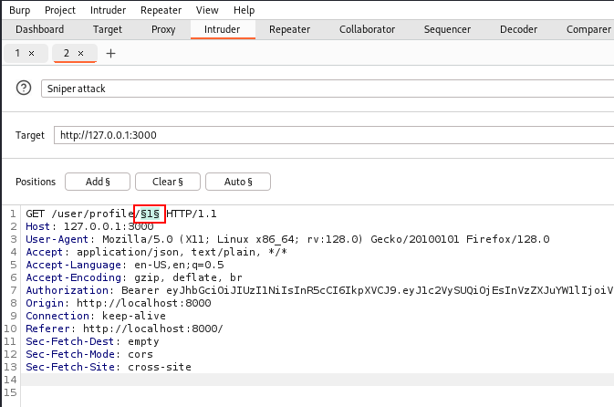
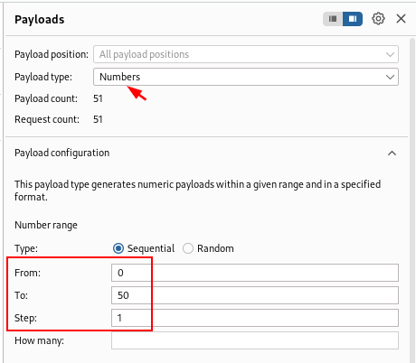
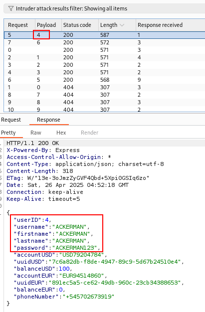
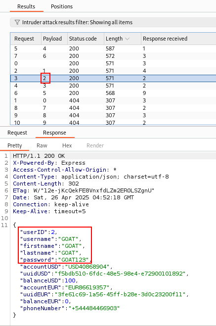

# PII of Users Disclosure

🛡️ **OWASP Category:** A01:2021 - Broken Access Control  

🧩 **CWE Category:** CWE-200: Exposure of Sensitive Information to an Unauthorized Actor  

---

## 📝 Description

When accessing the "View Profile" option, information related to the authenticated user is displayed, such as first name, last name, username, and phone number. However, upon intercepting the corresponding request, a GET request to the endpoint `/user/profile/1` was identified. This request returns not only the aforementioned data but also additional sensitive information such as accountUSD, uuidUSD, balanceUSD, accountEUR, uuidEUR, and balanceEUR. By performing numeric fuzzing on the endpoint identifier, it was possible to access the profiles of other users, thereby exposing their personal and financial information without requiring additional authentication.

## 🐐 PayGOAT Example

To replicate this vulnerability in the lab environment, follow these steps:

1. After logging in, we accessed the "View Profile" option and intercepted the corresponding request using Burp Suite.

2. We sent the request to the "Intruder" tool, configured the payload on the "/user/profile/`1`" endpoint, and performed numeric fuzzing to test different user identifiers.

3. By reviewing the "Intruder" results and filtering by the "Length" column, we discovered valid values that exposed sensitive information from other users.

---
## 💥 Impact

The impact of a vulnerability that exposes usernames, passwords, and other users' accounts is critical, as it allows an attacker to take control of those accounts and potentially carry out banking fraud or other malicious activities.