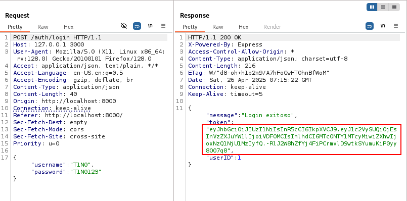
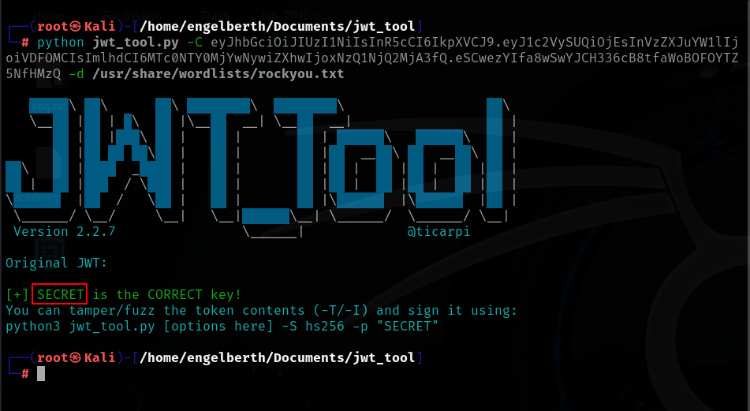

# JWT Weak MAC

🛡️ **OWASP Category:** A07:2021 - Identification and Authentication Failures 
🧩 **CWE Category:**  CWE-347 - Improper Verification of Cryptographic Signature 

---
## 📝 Description

The Json Web Token (JWT) uses a weak signing key, which was found through a dictionary attack. This allows for modifying and self-signing JWTs, enabling access to other users' accounts.

## 🐐 PayGOAT Example

To replicate this vulnerability in the lab environment, follow these steps:

1. After logging in, we obtain our session token, which is a JWT.

2. Using the "jwt_tool" tool, a dictionary attack can be performed with the following flags:

- `-C`: JWT token  
- `-d`: dictionary of possible keys.

---
## 💥 Impact

The impact of a weak JWT key is critical, as it allows an attacker to perform a dictionary attack to guess the secret key used to sign the token. This can lead to the modification and self-signing of JWTs, enabling the attacker to impersonate other users and access their accounts without the need for additional authentication.

---