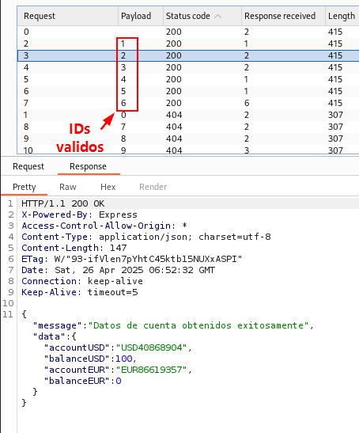

# View Information of Other Accounts

🛡️ **OWASP Category:** A01:2021 - Broken Access Control  
🧩 **CWE Category:** CWE-639 - Authorization Bypass Through User-Controlled Key   
---
## 📝 Description

It was identified that when viewing account details, the data is retrieved through a POST request containing the authenticated user's `userID`. By performing fuzzing on the `userID` parameter, it was possible to discover valid values and access account information of other users.

## 🐐 PayGOAT Example

To replicate this vulnerability in the lab environment, follow these steps:

1. Access the "My Accounts -> Details" section and intercept the corresponding request flow.

2. We observed how the request is transmitted during the interaction with the functionality.

3. We sent the request to the "Intruder" tool and configured a numeric fuzzing attack to identify valid IDs.

4. We reviewed the fuzzing results and, by analyzing the status code returned by the server, identified valid IDs and accessed information from other accounts.

---
## 💥 Impact

This type of IDOR vulnerability can be categorized as high severity, as it allows a user to view banking information of other users' accounts.

---