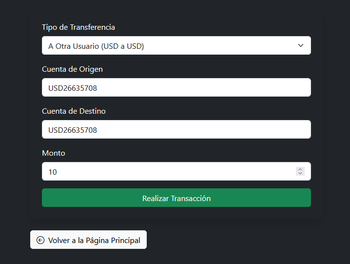
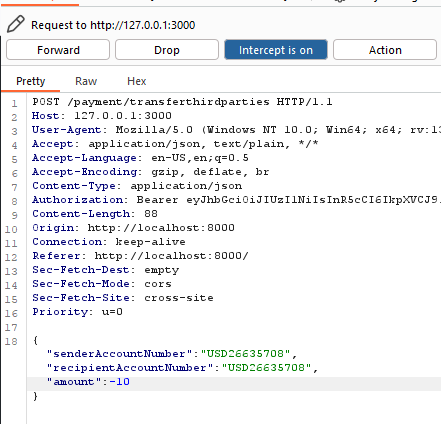

# Negative Numbers in Third-Party Transfers

🛡️ **OWASP Category:** A05:2021 - Security Misconfiguration 
🧩 **CWE Category:** CWE-704: Incorrect Type Conversion or Cast   

---

## 📝 Description

The application allows users to transfer money to third-party accounts by specifying an amount. However, it fails to validate whether the amount is a **positive number**.

An attacker can exploit this logic flaw by submitting a **negative value** in the transfer request. Instead of reducing their own balance, the server logic interprets the negative transfer as a **credit to the sender**, effectively pulling money from the recipient’s account or increasing the attacker's own balance illegitimately.

This kind of bug is common when arithmetic operations on user input are performed **without validation or type checking**.

## 🐐 PayGOAT Example

To replicate this vulnerability in the lab environment, follow these steps:

1. Log in to the application with a regular user account.
2. Go to the **Transactions --> Transactions** and select sending money to another user.

3. Intercept the transfer request using **Burp Suite**.
4. Modify the amount in the POST body or query parameter to a **negative value**, e.g., `-10`.

5. Forward the request.
6. Observe that the account balance increases or that the transaction goes through with reversed logic.

---

## 💥 Impact

**Business logic abuse** — users can manipulate transactions to receive money instead of sending it, resulting in unauthorized fund increases.

---