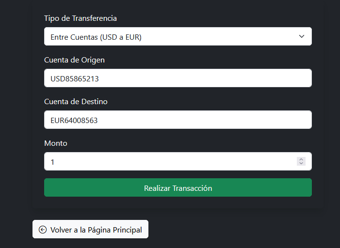
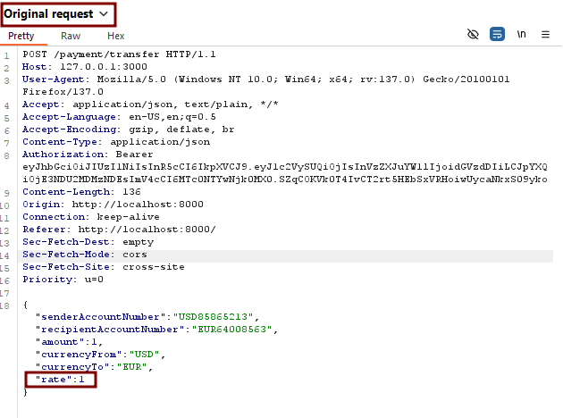
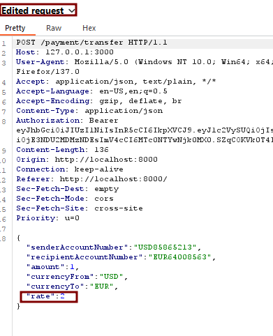

# Currency Exchange Rate Manipulation

🛡️ **OWASP Category:** A01:2021 - Broken Access Control 
🧩 **CWE Category:**  CWE-345: Insufficient Verification of Data Authenticity 

---

## 📝 Description

When a user exchanges money from USD to EUR, the frontend includes the exchange rate as part of the request payload. The backend trusts this value without verifying it against a trusted source. This allows attackers to **manipulate the exchange rate**, granting themselves unfair currency advantages during conversion.

For example, a user could increase the value of EUR received by altering the rate in an intercepted request, bypassing the intended logic of the banking application.


## 🐐 PayGOAT Example

To replicate this vulnerability in the lab environment, follow these steps:

1. Go to the transacctions section.



2. Use **Burp Suite** to intercept the request for transaction USD to EUR.



3. Modify the `rate` parameter in the JSON body, for example:



```json
{
  "senderAccountNumber":"USD85865213",
  "recipientAccountNumber":"EUR64008563",
  "amount":1,
  "currencyFrom":"USD",
  "currencyTo":"EUR",
  "rate":5
}
```
4. Forward the request.
5. Check the resulting EUR balance — it will be significantly higher than expected.

---

## 💥 Impact

**Business logic abuse** — allows users to exploit the exchange system to gain more funds than they should receive.

---