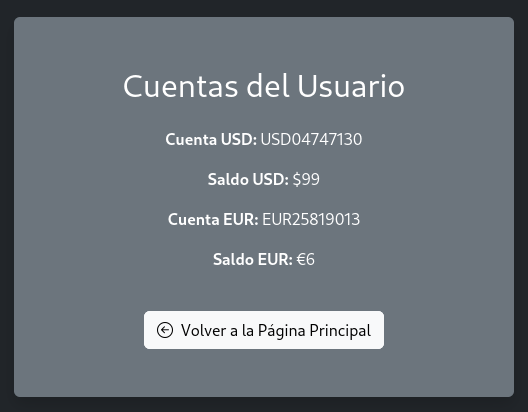
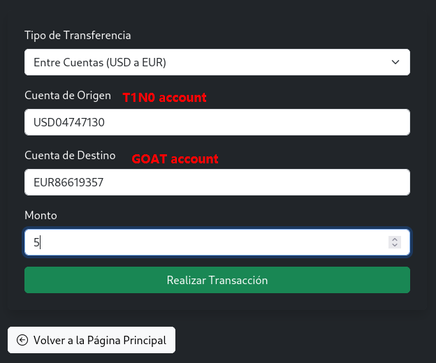
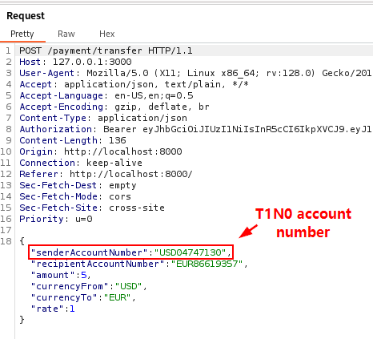
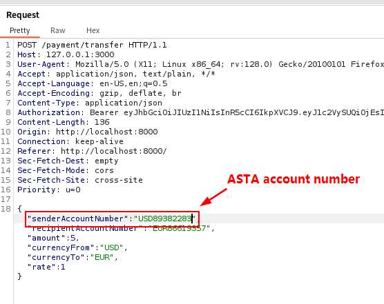
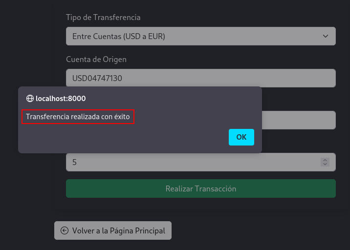
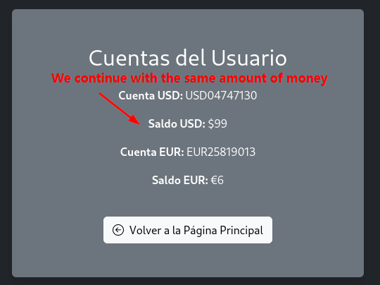
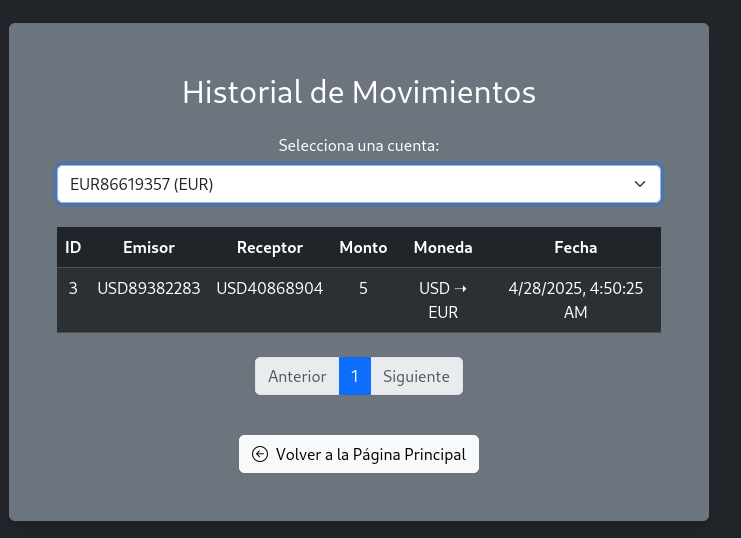
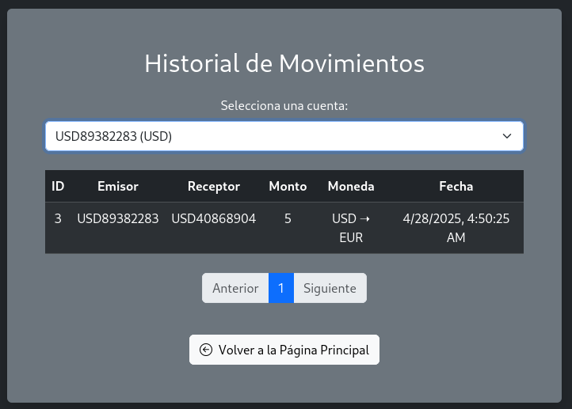

# Account Swapping in Transfers

🛡️ **OWASP Category:** A01:2021-Broken Access Control 
🧩 **CWE Category:** CWE-639 - Authorization Bypass Through User-Controlled Key   

---
## 📝 Description

During the transfer process, the parameters "senderAccountNumber" and "recipientAccountNumber" are sent in the request body, corresponding to the source account (from which the money will be debited) and the destination account (where the money will be credited), respectively. The value of the "senderAccountNumber" parameter was modified by replacing the authenticated user's account number with the account number of another user. As a result, the transfer was successfully completed, and the funds were debited not from the authenticated user's account, but from the other user's account.

## 🐐 PayGOAT Example

To replicate this vulnerability in the lab environment, follow these steps:

1. We verified the available balance in the accounts associated with the user T1N0.

2. Then, we navigated to the transfer functionality and selected the account to be debited and the account to be credited.

3. Then, we performed the transfer, captured the request, and observed data such as the account number from which the money would be debited, the account number where it would be credited, and the transaction amount.

4. We proceeded to replace the account number of user T1N0 with the account number of user ASTA and sent the corresponding request.

It tells us that the transfer was successful.

5. We conducted a new review of the balance in the associated accounts.

6. Upon reviewing the transaction history of account USD40868904 from user GOAT, we noticed that a balance of 5 was credited to our account.

7.  Subsequently, upon reviewing the transaction history of account USD89382283 from user ASTA, we noticed that a balance of 5 was debited from our account.

---
## 💥 Impact

The impact of this vulnerability is considered critical, as it allows a user, when performing a transfer, to modify the value of the parameter corresponding to the debit account number and insert the account number of another user, enabling the transfer to proceed and funds to be debited from an unauthorized account.

---