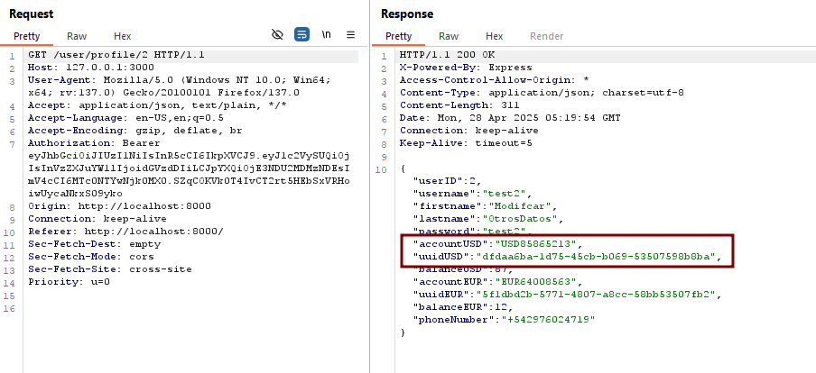
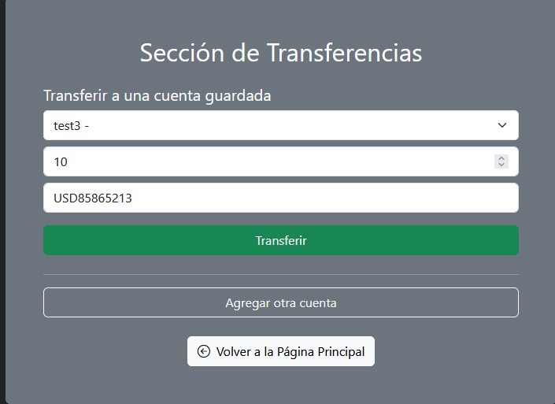
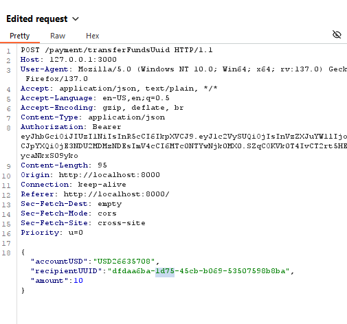

# Unauthorized Account Swap in Third-Party Transfers Using UUID

🛡️ **OWASP Category:** A01:2021 - Broken Access Control   
🧩 **CWE Category:** CWE-639: Authorization Bypass Through User-Controlled Key  

---

## 📝 Description

The application allows money transfers by submitting both the sender’s and recipient’s account identifiers. While the recipient’s account uses a UUID, the sender’s account uses a regular numeric ID. This creates a flawed assumption that UUIDs are secure and unforgeable, but the backend does not enforce ownership checks.

As a result, an attacker who knows their own UUID can manipulate the transfer request by swapping the identifiers: using the victim’s numeric account as the sender, and their own UUID as the recipient. Since the system does not validate who owns the accounts involved, it leads to unauthorized fund transfers.

## 🐐 PayGOAT Example

To replicate this vulnerability in the lab environment, follow these steps:

1. Log in as an attacker.
2. Obtain your own UUID from the profile section.

3. Go to transacctions --> TransacctionsV2
4. Select account to transfer

5. Intercept a transfer request using **Burp Suite**.
6. Modify the request:
   - Replace the `accountUSD` field with the **victim’s** numeric account ID.
   - Replace the `recipientUUID` field with the **attacker’s** account UUID.

7. Forward the request and confirm the balance increases on the attacker’s side.

---

## 💥 Impact

**Business logic abuse** — allows an attacker to receive funds from other users by tampering with account identifiers in the transfer request.

---