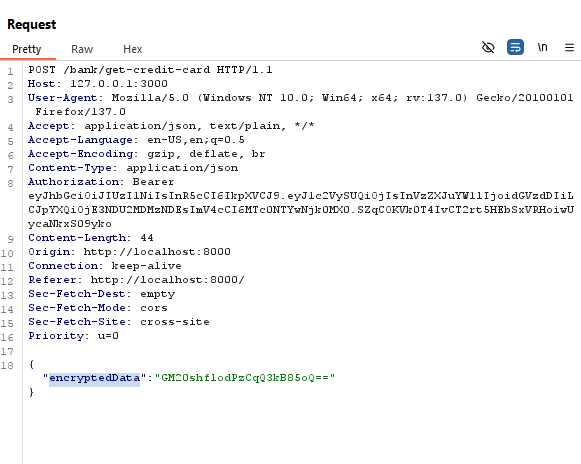
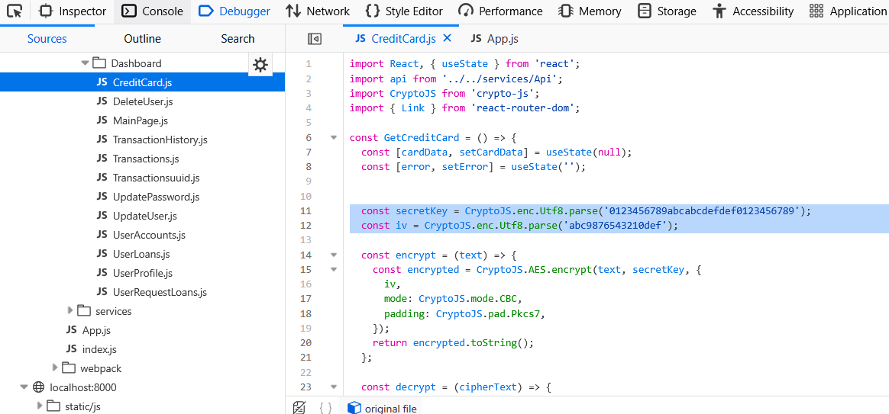
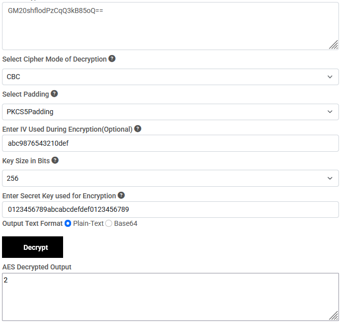
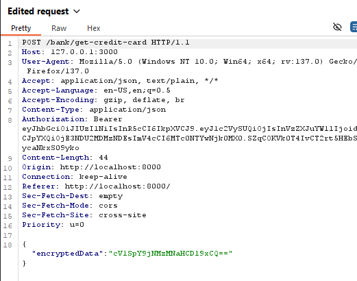
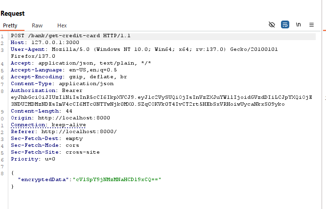
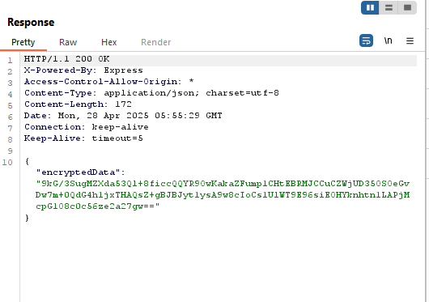

# Access to Other Users' Cards via Insecure Encryption

🛡️ **OWASP Category:** A02:2021 - Cryptographic Failures 
🧩 **CWE Category:** CWE-325: Missing Required Cryptographic Step   

---

## 📝 Description

In the production version of the application, the **userID** is encrypted and sent with requests related to user data access (e.g., retrieving credit card information). However, the encryption key is unintentionally exposed in JavaScript files loaded by the browser.

With this key, attackers can decrypt any encrypted userID, craft requests using other users' identifiers, and access restricted resources such as credit card data without proper authorization.

## 🐐 PayGOAT Example

To replicate this vulnerability in the lab environment, follow these steps:

1. Log in to the application as a normal user.
2. Use a feature that sends the **encryptedData** to the backend (e.g., userID).

3. Open the browser's **Developer Tools** (`F12` or `Ctrl+Shift+I`) and go to the **Debugger** tab.
4. Locate JavaScript files and inspect them. Search for terms like `decrypt`, `AES`, or `key`.
5. Extract the **encryption/decryption key** from the code.

6. Use a decryption tool: https://www.devglan.com/online-tools/aes-encryption-decryption

7. Replace it with another valid decrypted userID (e.g., incrementing an ID or guessing based on pattern).

8. Resend the modified request using **Repeater** in **Burp Suite**.

9. Observe that the application returns another user's data, such as their credit card information.

---

## 💥 Impact

**Control flow bypass** — it's possible to access functions where an OTP or authenticated user session is expected, simply by tampering with encrypted user identifiers.

---