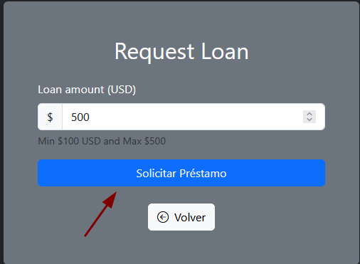
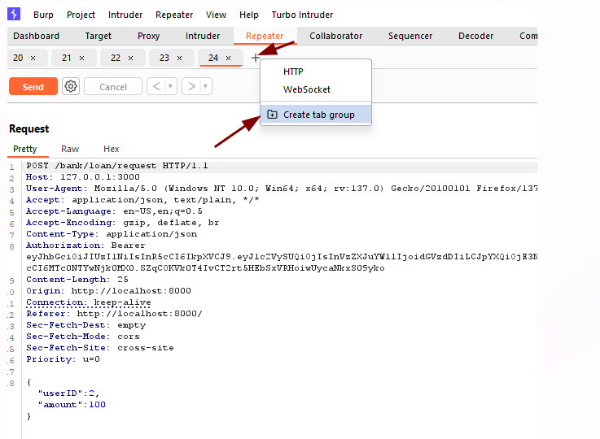
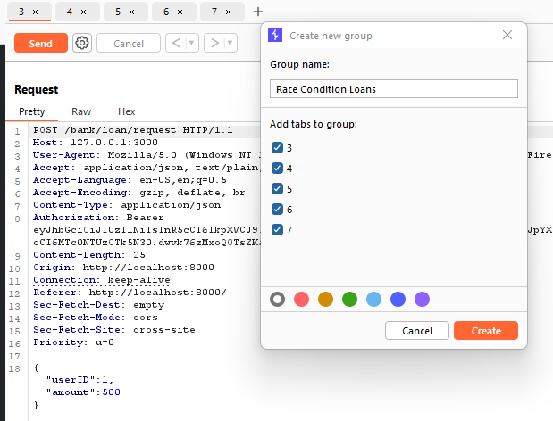
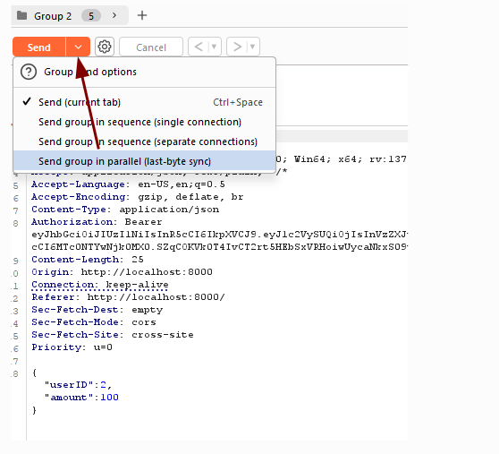
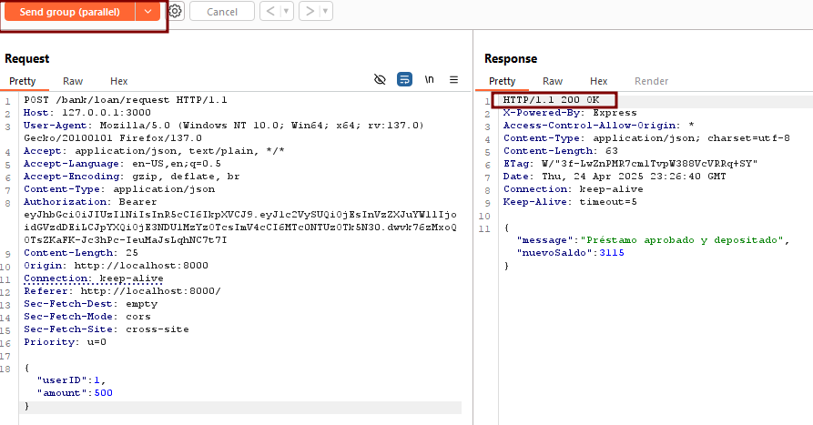
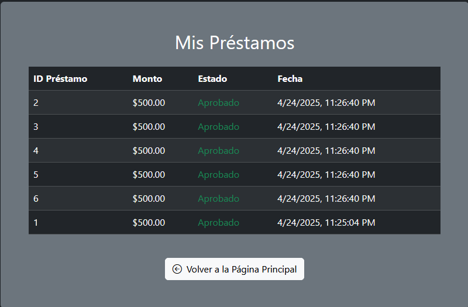

# Race Condition in Loan Requests

🛡️ **OWASP Category:** A01:2021 - Broken Access Control 
🧩 **CWE Category:** CWE-362: Concurrent Execution using Shared Resource with Improper Synchronization ('Race Condition')

---

## 📝 Description

The application allows users to request loans, but is intended to limit each user to a **maximum of 2 concurrent loans**. However, this logic is enforced only on the backend after loan requests are processed individually.

Due to the lack of proper synchronization or atomic operations, an attacker can exploit a **race condition** by sending multiple loan requests at the same time. This bypasses the business rule and results in **more than the allowed number of loans** being granted.

## 🐐 PayGOAT Example

To replicate this vulnerability in the lab environment, follow these steps:

1. Login to the application as a regular user.
2. Navigate to the **Loan Request** feature and send a legitimate loan request.

3. Intercept the request and send it to **Repeater** five times.
5. Group all 5 requests into a **folder** by selecting them and using **+**.

6. Select **"Send group in parallel"** and send.

7. Observe the responses and check your user account.

8. Despite the loan limit, **more than 2 loans** may be granted if the backend lacks proper synchronization.

---

## 💥 Impact

Control flow bypass — users can obtain unauthorized financial benefits by exploiting the loan system and bypassing loan limits.

---