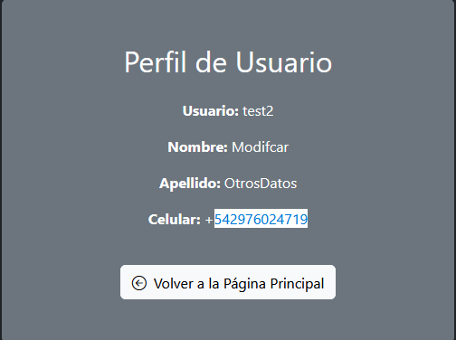
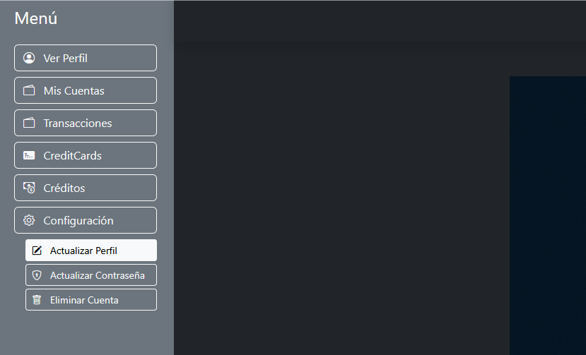
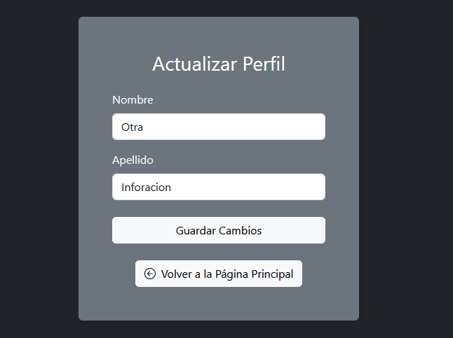
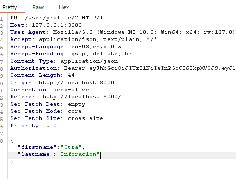
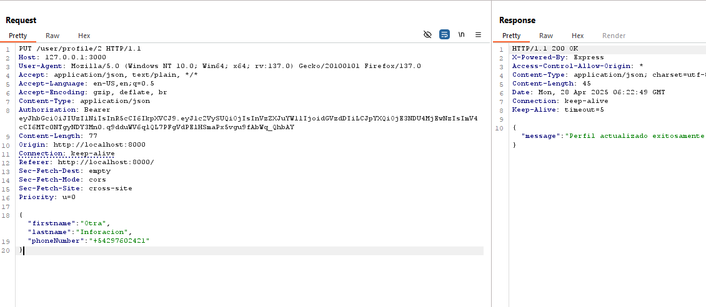

# Unauthorized Profile Field Modification

🛡️ **OWASP Category:** A01:2021 - Broken Access Control 
🧩 **CWE Category:** CWE-915: Improperly Controlled Modification of Dynamically-Determined Object Attributes  

---

## 📝 Description

The profile update endpoint accepts a JSON body to modify user details. While the frontend form only exposes editable fields like `firstname` and `lastname`, other sensitive fields such as `phone` are still processed if included in the request. 

This allows attackers to modify fields that should not be changeable through the UI — like the phone number used for OTP verification — simply by adding them manually to the intercepted request.

## 🐐 PayGOAT Example

To replicate this vulnerability in the lab environment, follow these steps:

1. Profile information before modification.



2. Navigate to **Settings --> Update Profile** section.



3. Use **Burp Suite** to intercept the update request.




4. Modify the JSON body to include the hidden field:

```json
{
  "firstname": "Kevin",
  "lastname": "Mitnick",
  "phoneNumber": "+54555555555"
}
```


**How do we know which parameters to include when updating the profile?**

When retrieving the user’s information, the server's response reveals the parameters that can potentially be updated, such as phoneNumber. By inspecting this response, an attacker can attempt to modify fields that were not originally intended to be editable.

---

## 💥 Impact

**Business logic abuse** — allows changing the registered dates without proper authorization or UI support.

---